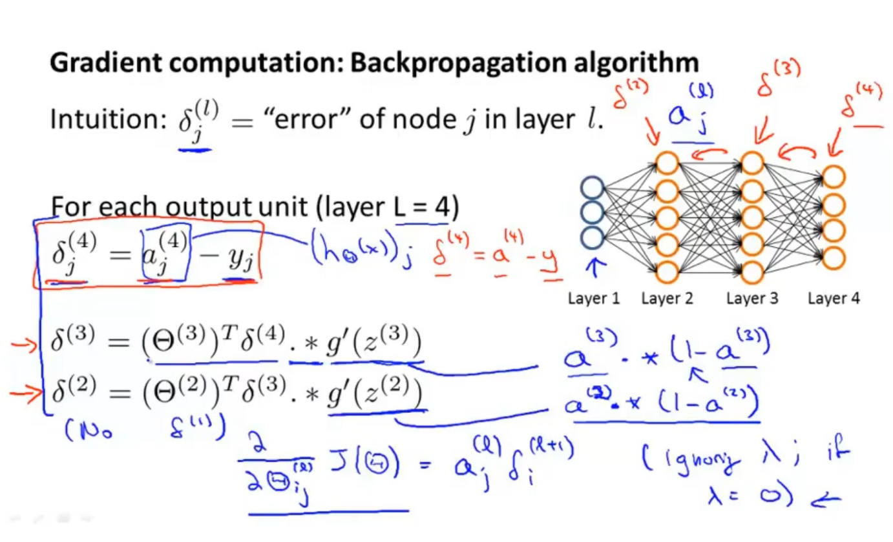
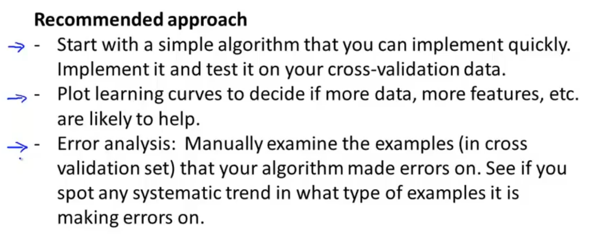
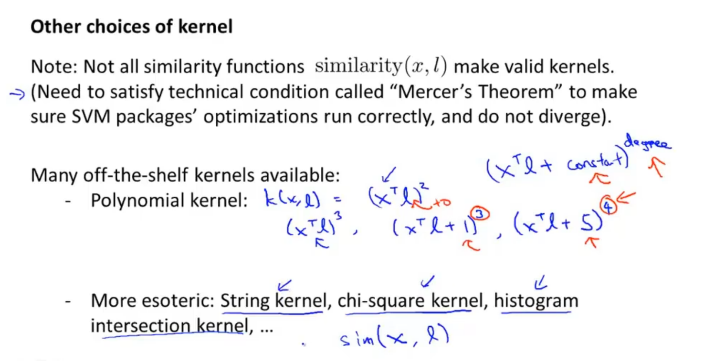
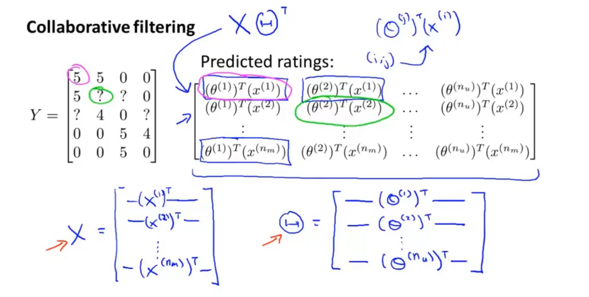

# Supervised Learning & Unsupervised learning

supervised: We teach computer how to do things

unsupervised: Computer learn things by themselves

## Supervised Learning:

The machine is given a set of "correct answers" by which it can predict the given unknown ones.

Regression: we need to output continuous value

Classification: we need to give its class (discrete value)

## Unsupervised Learning:

The machine does not know the classes in advance. Instead it should extract the feature itself and do the **clustering**. 

Clustering: group sets of data according to some characteristics

# Linear Regression

input ---> hypothesis function ---> output

for linear regression, the hypothesis function is linear,

univariable linear regression: input is one variable

# Cost Function

The linear regression is to find a hypothesis function h that makes a function J(h) to be minimized. This function J is called cost function.

# Gradient Descent

Mathematical expression:


Batch gradient descent: each step looks at the entire data set

# Multiple Features

Not only one variable

Some techniques:

- feature scaling: make the value of different features to be close to each other

# Polynomial Regression

# Normal Equation


# Logistic Regression

a algorithm for a classification problem.

output y can be either 0 or 1

It can be represented as follows

$$
0 < h_{\theta}(x) < 1
$$
The hypothesis function here denotes the probability that y=1.

Unusually, 
$$
h_{\theta}(x) = g(\theta^Tx) \\
g(z) = \frac{1}{1+e^{-z}}
$$

## Decision Boundary

It's the curve that separates the data set into 2 different classes. As long as the the parameter \theta is determined, the decision boundary is determined.

## Cost Function for Logistic Regression

By maximal likelihood method, the cost function for logistic regression is 
$$
Cost(h_\theta(x^{(i)}),y^{(i)}) = -y^{(i)}\log(h_\theta(x^{(i)}))-(1-y^{(i)})\log(1-h_\theta(x^{(i)})) \\
J(\theta) = \frac{1}{m}\sum_{i=0}^{m}Cost(h_\theta(x^{(i)}),y^{(i)})
$$
Then by gradient descent, we have 

```
Repeat until J(\theta) is minimal{
	\theta_i = \theta_i - \alpha \partial J(\theta)/\partial \theta_i
}
```

# One vs. Many Classification

There are more than 2 classes.

Each time we choose one class and consider the rest of the classes to be one class, do the logistic regression to get the corresponding hypothesis functions. Then for the future prediction x, we just plug it into every hypothesis function and choose the maximal one to be its class.

# Overfitting

Due to too many variables, the hypothesis function can fit the test set well but has a poor performance on real prediction.

# Regularization

Adding a penal term into the cost function so that in order to minimize the cost function, the parameters should be smaller, which realizes a kind of control.

## Regularization in Linear Regression

For gradient descent, the difference is that we have a multiple on theta_i before subtraction
$$
\begin{aligned}
\theta_j &=\theta_i - \alpha \cdot \frac{1}{m}\sum_{i=1}^{m}(h_\theta(x^{(i)})-y^{(i)})\cdot x^{(i)}_j-\frac{\alpha \lambda}{m}\theta_j \\
&=\theta_j(1-\frac{\alpha \lambda}{m}) - \alpha \cdot \frac{1}{m}\sum_{i=1}^{m}(h_\theta(x^{(i)})-y^{(i)})\cdot x^{(i)}_j \\
:&= \theta_j - {\alpha} \frac{\partial J_{new}(\theta)}{\partial \theta_j} \\
\end{aligned}
$$
For normal equation, the difference is that we add an additional matrix
$$
X = \left[ \begin{array}{c} (x^{(1)})^T \\ 
\vdots \\
(x^{(m)})^T
\end{array}\right] \qquad
y = \left[ \begin{array}{c} y^{(1)}\\ 
\vdots \\
y^{(m)}
\end{array}\right] \\
\min_\theta J(\theta) \Rightarrow \theta = (X^TX+\lambda \cdot \left[ \begin{array}{cccc} 0&0&0&0\\ 
0&1&0&0\\
0&0&\ddots&0 \\
0&0&0&1
\end{array}\right])^{-1}X^Ty
$$

## Regularization in Logistic Regression

The change is the same as the gradient descent in linear regression except for the hypothesis function

# Non-linear Hypothesis: Neural Networks

Actually it's a combination of several logistic regressions. The hidden layers can transform the original input features to be "new features" such that it can represent more complex characteristics. 

# Neutral Network for One vs All problems

It is the same as one vs all problem previously, except that the output layer has more than one activation units.

The cost function becomes (the difference is that the hypothesis function is K dimensional and )
$$
\begin{aligned}
J(\Theta)=&-\frac{1}{m}\left[\sum_{i=1}^{m} \sum_{k=1}^{K} y_{k}^{(i)} \log \left(h_{\Theta}\left(x^{(i)}\right)\right)_{k}+\left(1-y_{k}^{(i)}\right) \log \left(1-\left(h_{\Theta}\left(x^{(i)}\right)\right)_{k}\right)\right] \\
&+\frac{\lambda}{2 m} \sum_{l=1}^{L-1} \sum_{i=1}^{s_{l}} \sum_{j=1}^{s_{l+1}}\left(\Theta_{j i}^{(l)}\right)^{2}
\end{aligned}
$$

# Backpropagation

It's used to "minimize" cost function 

 


Note that to use the algorithm developed before in Advanced optimization, we need to unroll the matrices in this process into vectors.

# Numerical Estimation

To check that whether the back prop gives the right derivative, we can can calculate it by definition:
$$
\frac{\partial J(\theta)}{\partial \theta_i} = \frac{J(...,\theta_i+\varepsilon,...)-J(...,\theta_i-\varepsilon,...)}{2\varepsilon}
$$
If this is (approximately) equal to the back prop result, we can use back prop confidently.

But after verification, remember to disable the numerical checking since it's very time consuming.

# Summary

Training a neural network has the following steps:

1. Randomly initialize weights;
2. Implement forward propagation to get $ h_\theta(x^{(i)})$ for any $x^{(i)}$;
3. Implement code to compute cost function $J(\Theta)$;
4. Implement back propagation to compute partial derivative $\frac{\partial J(\Theta)}{\partial \Theta_{jk}^{(i)}}$.

For i = 1:m repeat the procedure above for all examples.

5. To check the back prop gives the right answer, use the gradient checking (calculate the partial derivative by def) and compare two results. 
6. Use gradient descent or other more advanced algorithm to minimize the cost function to get the weight configuration.

# How to choose next step?

There are machine learning diagnostics to examine what's wrong if the model does not work very well.

Instead of splitting data into 2 pieces, we divide them into 3, namely training, validation and testing. The training set is used to generate some models that can be used for fitting. Then the validation set is used for choosing the "best" model. Using that to test. This can eliminate the influence of one "hidden variable" like the number of parameters.

# Bias (Underfitting) & Variance (Overfitting)

bias occurs when the error (cost function) of both training set and validation set is large;

Variance occurs when the cost function of training set is small but that of validation set is large

# Learning Curves


The curve for Bias 


curve for variance

The difference here is that the gap between cost function of training and validation for bias is much smaller than that for variance. That means the increases data set seldom works for bias.

# System Building



## Skewed Class

y=1 occurs very rarely. In this situation, a classifier that always predicts y=1 has a high "accuracy".

In order to prevent that, we define that

- **Precision P** : $\frac{\# \text{true positive}}{\#\text{predicted postive}}=\frac{\# \text{true positive}}{\#\text{true postive}+\#\text{false positive}}$;
- **Recall R**: $\frac{\# \text{true positive}}{\#\text{Actual postive}}=\frac{\# \text{true positive}}{\#\text{true positive}+\#\text{false negative}}$

A model with high precision and high recall is considered as good model.

Unfortunately, they cannot be high at the same time most of the time. We should do some balance.

There is a f1 score that can be used.
$$
F_1 = \frac{2PR}{P+R}
$$
Base on that we can choose the thresholds.

# More Data?

Sometimes more data actually helps. For example, the feature x can really predicts y well by human, or the number of features and data is really huge.

# Support Vector Machine (Large Margin Classifier)

It's quite similar to the logistic regression, except that the cost function is simplified to piecewise functions.


SVM gives a more rigorous boundary, 


SVM, with large C, can be easily influenced by outliers. But it can still do good job to the data set that is not linearly separable.

The mathematical principle behind it is the minimization of inner product of parameter vector data example vector.

# Kernels

For the problem of Non-linear decision boundary, we should definitely add the features to make the boundary more "complex". Instead of just choosing higher order polynomials, we can choose the features in the following way:

1. Choose some landmarks;
2. Compute the "similarity function" (kernel function) with data points and landmarks and use that to be the feature $f=kernal(x^{(i)},l^{(j)})$;
3. Compute hypothesis function based on the features and make decision.

One common kernel function is Gaussian Kernel function $e^{-\frac{||x^{(i)}-l^{(j)}||^2}{2\sigma^2}}$ 

SVM parameters:


# Usage of SVM

## The choice of Kernel



## Logistic Regression vs. SVMs


# Unsupervised Learning

## K-mean algorithm


To summarize:

1. Randomly choose K cluster centroids.
2. For each data point, compute the distance to each cluster centroid and assign it to the nearest clusters.
3. For each cluster, compute its centroid and update the old one.
4. Repeat step 2, 3 until the cluster is fixed (no data point will change its cluster after the iteration)

The cost function here is the sum of square of distance between each data point and its corresponding cluster centroid. By randomizing centroids for several times and then compute its cost function, we can find out the global optimum by having the minimum cost function.

As for the number of clusters K, there is no clear algorithm to choose that. More we do is to consider it in the aspect of later usage of data (business stuff)

# Principle Component Analysis (PCA)

It's can be used for dimensionality reduction and do some early application on that.

The objective of PCA is to minimize the sum of square of distance between each data point to the subspace, different from linear regression.

## Implement


Note that we should first do the mean normalization and featuring (if necessary)

## How to choose factor k?

Typically, choose k to be the smallest so that 
$$
\frac{\frac{1}{m}\sum_{i=1}^m||x^{(i)}-x_{approx}^{(i)}||^2}{\frac{1}{m}\sum_{i=1}^m||x^{(i)}||^2} \leqslant p
$$
where p is a factor that is normally 0.01, 0.05 or 0.1.

The numerator is average square projection error and denominator is the total variation in the data

## Reconstruction from Compressed Expression


Just apply
$$
X^{(i)}_{recons} = U_{reduce}z^{(i)}
$$
where z is compressed expression of original data point

## Usage

There are some misusage sometimes

1. Use PCA for preventing overfitting (Use regularization)
2. Incorporate PCA at the beginning of the project (Try raw data first)

So the main use of PCA is to speed up the algorithm, compress data for saving memory or visualization

# Anomaly Detection

## Gaussian Distribution

The formula of Gaussian Distribution is 
$$
p(x; \mu, \sigma) = \frac{1}{\sqrt{2 \pi}\sigma}e^{-\frac{(x-\mu)^2}{2 \sigma^2}}
$$

## Anomaly Detection Algorithm


Here we assume that the the data set follows Gaussian distribution, and compute mean and variance using parameter estimation.

## Algorithm Evaluation


Note that in the training set, all data points have y=0, meaning they are non-anomalous. Then using the cross validation set to find an appropriate threshold and features to use. 

In the first step, we are trying to fit the Gaussian distribution model sometimes.

## Feature Choice

- better to be in Gaussian distribution (can perform some transformation i.e. log(), ()^k, ...)
- should be remarkably large or small if it's a anomaly, so that it can be detected with a low probability in the Gaussian distribution.

# Supervised Learning vs. Anomaly Detection

The anomaly detection applies to those with only a slight number of positive examples or those with (constantly) variant positive examples.

The supervised learning applies to those with almost equal number of positive and negative examples and "positive type" is almost the same.

# Multivariate Gaussian Distribution

Instead of computing the probability of each feature and use their product, we now choose to compute it in one go.
$$
p(x; \mu, \Sigma) = \frac{1}{(2 \pi)^{(n/2)}}e^{(-\frac{1}{2}(x - \mu)^T \Sigma^{-1}(x- \mu))}
$$
where $\mu \in \mathbb{R}^n, \Sigma \in \mathbb{R}^{n \times n}$, n is the number of features.

One good advantage is that it allows user to adjust the "weight" of each feature and set the correlation between them by changing matrix $\Sigma$.

# Original vs. Multivariate

Original Gaussian distribution is special case of multivariate one with variance matrix has only diagonal elements.

Original algorithm is computationally efficient, whereas the multivariate algorithm is more accurate.

Original Gaussian distribution works even if the training set size is small, whereas the multivariate one must have m > n (much greater is fine) or $\Sigma$ will be non-invertible.

# Recommender System

## Optimization Objective


## Collaborative Filtering

Knowing the features of movies, the preference of users (parameters $\theta$) can be predicted. Conversely, given the preference of the users, the features of each movie can be estimated.


### Algorithm


It can also be used to recommend similar movies

### Vectorization



## Mean Normalization

If a user does not rate any movie, for example, we just predict its preference to be vector consisting of the mean of features.

# Stochastic Gradient Descent


Instead of taking all data to decide the next step, it updates parameters with every data point. So it does not need to go through all data points, which makes the process faster.

## Convergence of SGD


BGD plots J in every iteration, but SGD, given its fast iteration speed, updates J less frequently.

# Online Learning

Perform learning algorithm on continuous data stream, so after updating with one example, it just throw it away.

Also, online learning can adapt to the preference of latest group of users.

# Mini-batch Gradient Descent

It's somewhere between batch gradient descent (takes all examples in each iteration) and stochastic gradient descent (take 1 example in each iteration). It takes b examples one time. So if there is vectorizing optimization, it can run even faster than SGD.


# Map Reduce

With some computers, we can divide the summation work to individual computers so that it can have a fast speed.

# Machine Learning Pipeline


Starting from image, passing it to a series of machine learning blocks. Each block does part of the job and finally output the result we want, like the work done on the pipeline.

# Ceiling Analysis

Try to put efforts on the most necessary component!