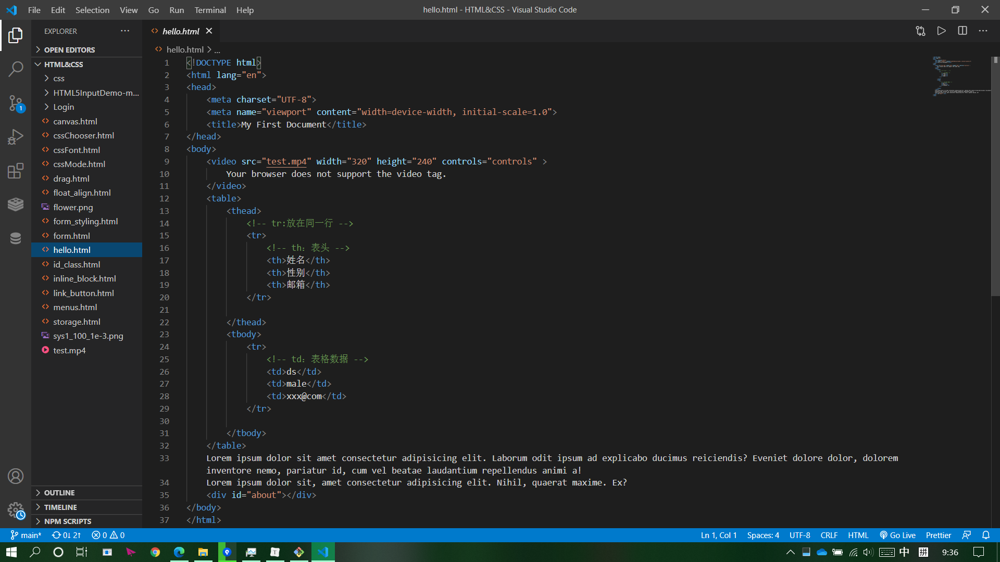
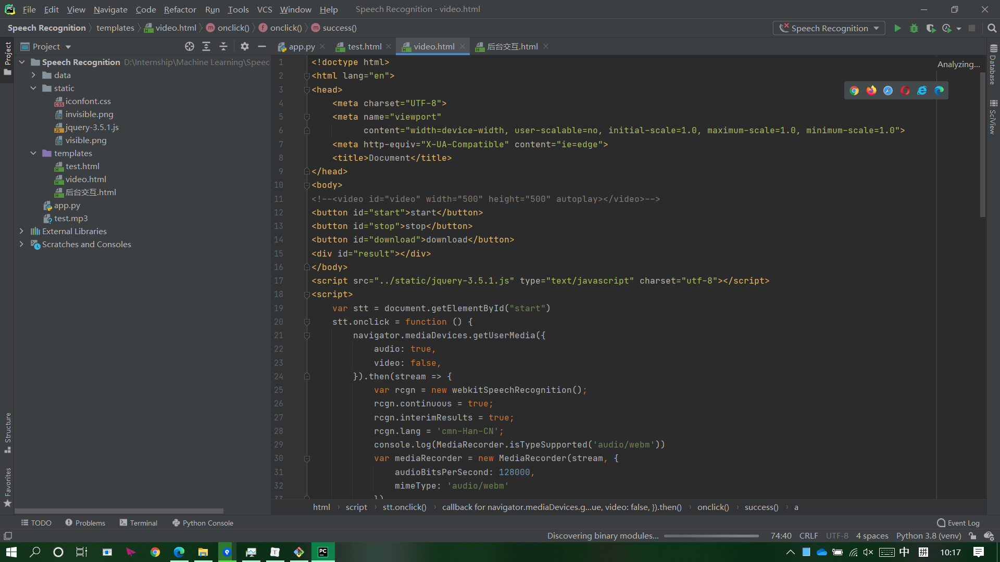

# Internship2021_Jan

Dec. 28, 2020 to Feb. 5, 2021

此次实习主要训练了前后端架构的搭建，以及简单涉及了机器学习部分

------

## 前端

前端部分主要为HTML的界面设计以及JavaScript的交互设计。

HTML语言是目前广泛用于页面编写的网页语言之一。HTML十分轻量，语法格式也相对简单，较容易入门。

本人以为一个用的顺手的编辑器对于编写HTML而言是一件不可或缺的利器。目前而言vscode+Live Server（vscode中的一个插件）是我以为比较好用的一个组合，vscode的自动补全功能十分强大，而Live Server能够实时刷新网页效果，免去了每次修改都要点击刷新的麻烦。

但这同样也有缺点，对于一个大项目而言（比如之后加入了后端服务器的内容后），网页的许多交互功能都需要后端的支持（比如python flask程序），这时候vscode就显得有些力不从心，操作起来就比较困难。这个时候我一般使用pycharm直接编写HTML，虽然写的时候麻烦了许多（pycharm的补全不算十分方便，毕竟它不是专门设计用来写HTML的），但调试起来更加轻松。



<center>图 1: vscode编写HTML</center>



<center>图 2: 使用pycharm编写HTML</center>

### HTML语言

HTML语言本身不算特别难。作为一种标记语言，它的格式十分固定，结构上也一马平川，没有什么循环，条件折腾。主要的难点在于设计页面。这实际上已经超出程序设计的范畴，更像是职业设计师该干的事。有一个好的审美应该是更为重要的事（确信）。

但也不是说语言本身没有一点难度。除却数量繁多的标签（每次想要实现一种新设计时都要找半天）外，最主要的还是标签样式的设计和调整。这部分由css来实现（因为它和HTML密切相关，所以没有分开讲）。令我印象最深刻的是margin，padding的调整和行标签块标签的选择。很多时候在代码中修改了，结果发现效果没有一点改变。这令我头疼了好久，在实习的后半段我才发现了可以在控制台中直接查看元素的各种属性。很多时候自定义的属性没有用往往都是因为浏览器自动渲染的属性覆盖了。在控制台中可以清晰的看见源代码（包括自己写的和这个标签本来自带的）中各项的使用情况，没有被渲染上去的往往显示被划去。这就可以发现你写的到底在是哪里被覆盖了，对症下药，更加有效。

### JavaScript

网页除了静态展示外，更重要的是交互。HTML的网页主要使用JavaScript进行交互。JS作为脚本语言由简单轻量，主体由一个个函数组成，通常是在触发某些事件（比如按钮被点击）后执行。JS的整体风格对我而言更像C/C++，所以学起来也不算特别困难。

JS主要分为DOM操作和JQuery，（BOM用的不多）。JQ实际上就是写好的JS脚本集合，省去了许多复杂的代码，提供了更高效方便的API。不过需要注意的就是JQ和DOM方法并不相同，在使用时要注意不能混用。

在我所做的这些项目中，用JQ相对较多，一是在其较为简洁，二是在与后端的交互过程中，JQ提供的ajax方法十分简单高效，而DOM操作却没有现成的轮子可用。

在JS中，选择器的使用是重点，无论是css进行样式渲染，还是JQ选择对象进行操作。但不幸的是，我在实际编写的时候并不能好好安排，以至于类的数量过于繁多。我认为在这样的情况下，还是选择直接添加样式比较好。

## 后端

后端部分是我本次实习的重点，主要包括了mysql数据库的使用和flask框架的搭建，在此基础上还简单拓展了非关系性数据库Redis和python的一些高级特性。

### MySQL

mysql数据库是基于sql命令进行操作的一种关系性数据库，主要用于存储较为结构化的关系型数据库，比如用户的注册信息等。直接使用命令行使用mysql数据库较为复杂，但也是必须掌握的（python中操作就必须通过命令行来完成，而我在最后还出现了INSERT INTO TABLE导致报错却浑然不知的尴尬局面）。在这里需要指出的一点就是大部分用户在安装mysql的时候默认了开机启动，所以基本不会碰到启动相关的问题，而我的电脑有时需要手动启动，这时就需要以管理员身份运行命令行再执行net start mysql命令。然后mysql的用户添加授权操作也是一个迷，我试了好久网上的各种方法都没有用，只能暂且作罢。

平时查看表格，做一些简单插入或者修改表结构的操作还是用navicat比较好，只可惜这是个付费软件，而且教育优惠只有一年还不能重复申请。太小气了：（

### Flask

flask是一种轻量的网络应用框架，结构十分明晰，它主要结构使用的python的装饰器，称为视图函数，它用于处理不同url的请求返回一定的结果。在前后端分离的原则下，视图函数的主要作用就是返回前端所需要的数据，以及在生成最开始的页面（url为'/'）。页面的跳转在前端HTML进行。

困扰我本次实习始终的就是flask前后端之间的数据传输的问题。前端ajax主要发送的是序列化的JSON数据和表单（两者都是键值对的形式，不同的是前者主要用于传输文本数据，后者主要用于传输文件信息，例如图片和音频）。前端收集的数据怎么包装？发来的数据后端怎么接收并转变成可以处理的形式？然后相反地，从后端以什么形式发送？前端怎么接收并转变成自己想要的形式？通过这次实习，我能给出的答案是：对于纯文本，JSON来回传递是比较简单的，前端将数据包装成字典，然后JSON.stringify()变成序列化字符串后用ajax发送。后端用request.get_json()[keyName]接收。反之同理，后端return字典形式的数据（flask规定视图函数只能返回字符串，元组和字典形式的数据，并且要遵循一定的格式，我认为还是字典格式最好用）；对于其他类型数据（我这里只碰到了要用音频的情况），比如音频，录音结束后会返回一个复杂的对象，其中的data行包含的我们需要的数据。我们首先将其转化为blob类型的对象，type选择audio/mp3，将其再包装为同样type的文件，添加到表单中，再新建用XMLHttpRequest对象进行发送。十分复杂，并且最后一步如何读取发送回来的二进制内容的字符串对象我还没能解决。。。

```javascript
blob = new Blob([data.data], {'type': 'audio/mp3'})
let file = new window.File([data.data], 'audio', {type: 'audio/mp3'})
let form = new FormData()
form.append('wave_file', file)
console.log('xml')
var xml = new XMLHttpRequest()
xml.open('POST', '/save')
xml.send(form)
```

### Redis

Redis作为非关系型数据库主要以键值对形式储存数据。在我实习期间，还没有遇到能完美使用这一中数据库的情况，所以我对它的了解比较少。令我印象最深刻的一点还是它用有定时删除的功能，所以我以此做了一个验证码系统。但说实话这个东西比较牵强，不是非要数据库不可。。。

### Python高级

本次实习我大概有一周的时间用于python高级特性的学习。主要学习的就是python的多任务特性以及继承方面的一些知识，这也是我想要在实习后继续学习的一个方向之一。不过现在我的理解还不是特别深入，因此也无法给出一个总结。

## 机器学习

终于到了最激动人心的机器学习环节了！

最大的收获还是对机器学习有了简单的了解，对一些的基本的模型的运作原理有了一定认识。比如监督学习的线性回归，逻辑回归和支持向量机，以及非监督学习的k-mean聚类算法。还有梯度下降算法，bias和variance等概念。这使得我在阅读相关资料时不再迷茫。这是我想在实习后继续学习的另一个方向。

本次我机器学习的内容主要还是学习，应用只不过是用模板跑了SVM和fasttext。但我在实际写代码时，还是碰到了不少问题。主要还是python不够熟悉，需要借鉴别人的代码，在使用的时候没有看清接口上的细微差别导致出错。这也从侧面说明了码力重要性（废话）。


p.s. 推送时时sourcetree崩了，一直跳出提示要求输入用户名密码，但输对了也没用。结果是因为git更新了不支持弹窗密码验证出现的问题。。。太zz了

出于这个原因，我还在最后一天学习了git的相关知识，以防再次被坑。

