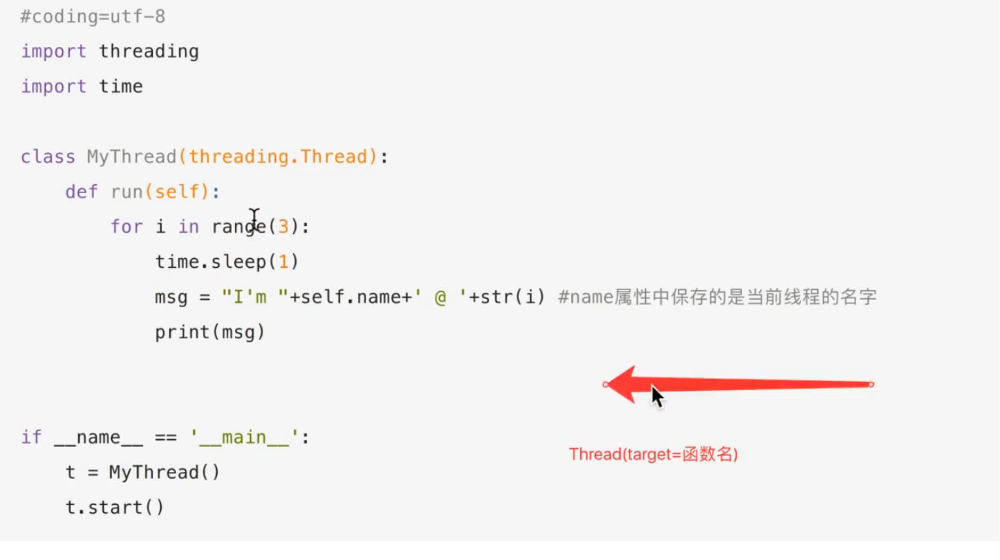
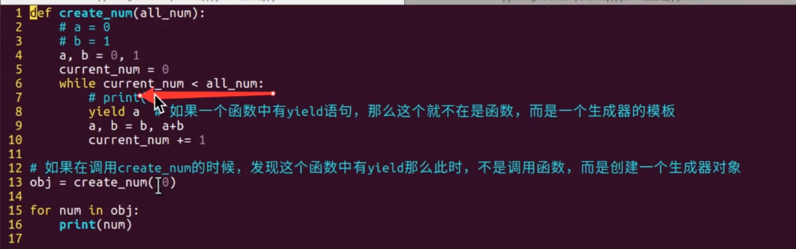
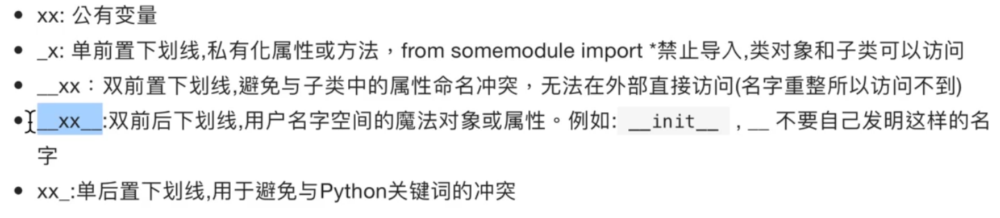
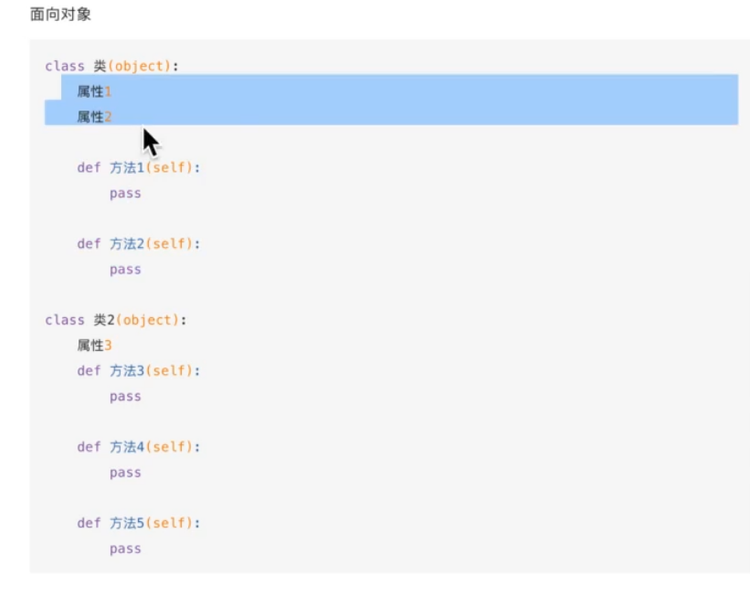
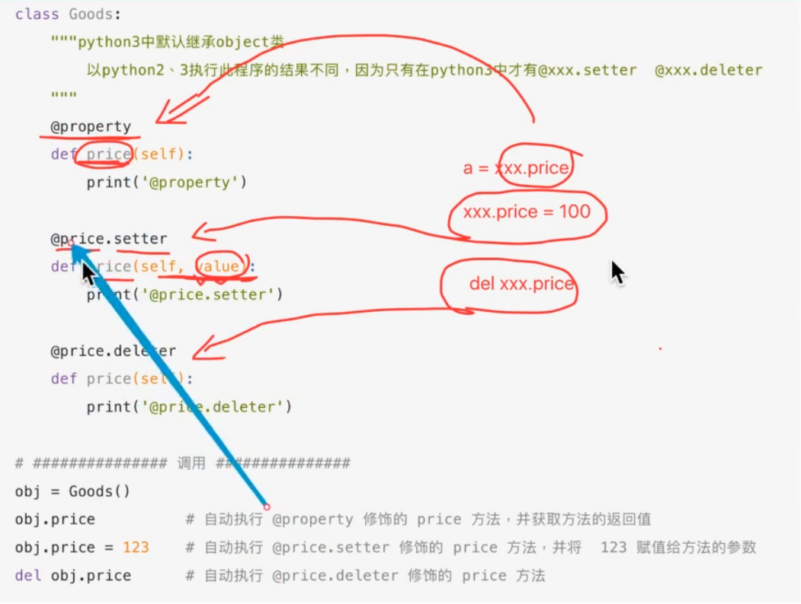
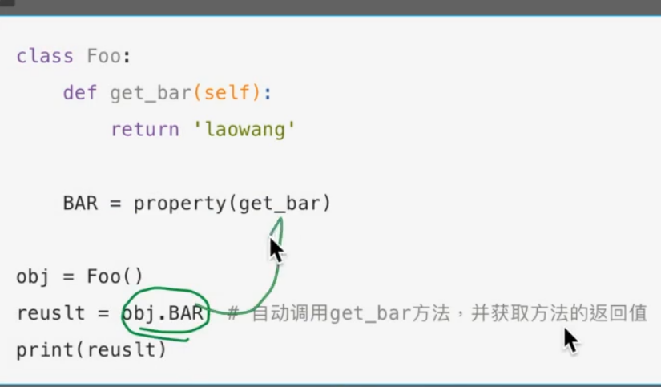
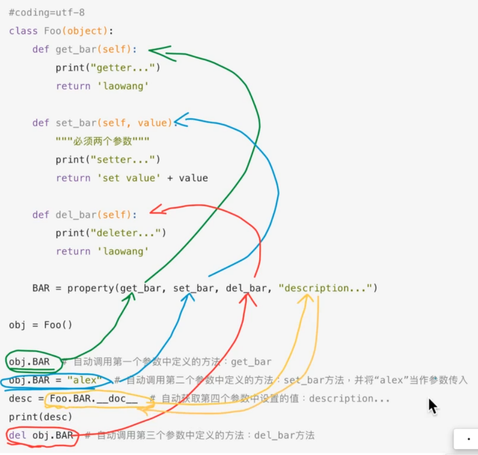

# 多任务

多个函数一起执行

单核cpu也可以执行多任务（时间片轮转/优先级调度），由操作系统控制

并行：真的多任务

并发：加大多任务

格式：threading.Thread(target=...)

会创建子线程，单独运行target中的函数

线程运行没有先后顺序（不确定）

当调用thread时，不会创建线程；当器创建的实例对象调用start是，创建了子线程

target还可以是类



MyThread继承了父类threading.Thread

类里面还能定义别的函数

# python全局变量

是否加global要看是否对变量的指向进行了修改

子线程之间共享全局变量，这样就可以再线程之间进行分工

**共享全局变量问题**：会出现资源竞争（操作系统在没有执行完成事务是就切换）

**解决方法**：同步，互斥锁（使用时上锁，别的任务不能使用资源）

**互斥锁也存在问题**：死锁

**避免死锁**：1. 添加超时时间；2. 算法设计（银行家算法）

# 进程

一个exe文件只是磁盘上静止的，叫做程序；当它运行后，它的代码及其所用的资源（摄像头、键盘、蓝牙等）称为进程

进程能实现多任务，但耗费的资源最大

**进程和线程的对比**：进程拥有资源，分配调度给线程执行不同的部分；进程之间相互独立，而同一进程内的线程共享资源

**进程间通信**：在同一台电脑上，可以有socket，queue以及文件读写来完成。而queue队列十分常用

**进程池**：预先创建一定数量的进程，同时进行一些任务。当有任务执行完时，进程不销毁而是去执行下一个任务。这样减少了创建和销毁进程的花费

# 协程

## 迭代器

可以极大地减小内存占用。相比列表，迭代器可以随用随生成

类型转换函数也使用了迭代器

## 生成器

一种特殊的迭代器 i.e. (x*2 for i in range(10))



如果一个函数中有yield语句，则该函数成为一个生成器，调用时创建生成器对象

当生成器执行到yield语句时，生成器执行暂停，返回结果到生成器外；当再一次进入生成器时，代码从yield后开始执行

生成器也可以return，return 的值在异常时储存在.value中（如下）

```python
while True:
    try:
        ret = next(obj)
        ...
    except Exception as ret:
        print(ret.value) # 捕获异常
        break
```

**协程优点**：不需要额外创建线程和进程，靠函数间的跳转特性来实现多任务并发。

## greenlet

对使用yield进行跳转的协程进行了封装，可以直接使用switch来进行切换执行的函数

## gevent

greenlet的升级版，可以在io操作时自动跳转到其他greenlet执行

# Web服务器

## 正则表达式

匹配单个字符

| 字符  | 功能                               |
| ----- | ---------------------------------- |
| .     | 匹配任意一个字符（除了\n）         |
| []    | 匹配[]中列举的字符                 |
| [1-8] | 匹配连续数据                       |
| \d    | 匹配数字                           |
| \D    | 匹配非数字                         |
| \s    | 匹配空白，即space, tab             |
| \S    | 匹配非空白                         |
| \w    | 匹配单词字符（a-z, A-Z, 0-9，中文) |
| \W    | 匹配非单词字符                     |

匹配多个字符

| 字符  | 功能                          |
| ----- | ----------------------------- |
| *     | 匹配前一个字符出现任意次      |
| +     | 匹配前一个字符出现至少出现1次 |
| ?     | 匹配前一个字符出现0次或1次    |
| {m}   | 匹配前一个字符出现m次         |
| {m,n} | 匹配前一个字符出现m到n次      |

分组

| 字符          | 功能                       |
| ------------- | -------------------------- |
| \|            | 匹配左右任意一个字符表达式 |
| (ab)          | 括号内作为一个分组         |
| \数字         | 引用分组num                |
| (?P<name>...) | 起分组名name               |
| (?P=name)     | 引用分组name               |

# python高级技巧

## GIL全局解释器锁

保证同一时刻只有一个线程在执行。是cpython解释器的历史遗留问题

可以使用javapython解释器来解释python语言，或者调用其他语言的代码来运行

GIL使得多核cpu的优势不能完全发挥。当遇到计算密集型程序时只能通过多进程解决，但IO密集型语言无影响

## 深浅拷贝

copy.copy(): 浅拷贝，对列表时只拷贝顶层列表，下层只拷贝引用；如果时元组，则只拷贝引用

copy.deepcopy(): 深拷贝，对元组如果有可变元素存在，则递归拷贝（深拷贝）；如果全部是不可变类型，则只是指向引用

= 列表切片 属于浅拷贝

# 私有化



# 面向对象：封装、继承、多态



# 多继承

一个子类继承多个父类

重载 ≠ 重写。在python中，函数名等同于变量名，不允许出现相同的函数名

# 静态方法、类方法


- 实例方法：由对象调用，至少一个self参数，执行时自动把该方法的对象赋值给self
- 类方法：由类调用，至少一个cls参数，执行时自动把该类赋值给cls
- 静态方法：由类调用，默认无参数

# property属性

把函数/方法（有返回值）当作了一个属性，调用时不需要加()

在新式类中（继承object），有几种放置创建property属性

## 装饰器



## 类属性





# 魔法属性

一些具有特殊作用的属性，在特殊的情况下会自动调用。

普通函数可以通过自定义魔法属性成为具有特殊功能（或者适用一些特殊功能）的函数


生成器、可循环对象、迭代器

单例

设计模式

# python鸭子类型

在python中，由于解释器是根据变量内容来推断变量类型的，当两个类具有完全相同的方法时便可以相互替代使用，省去了继承可能出现的问题

