## Dom 对象和jquery包装集对象

- **dom对象**：通过js方式获得对象

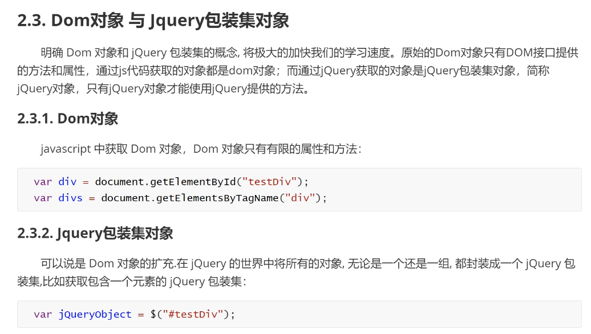

### 转换

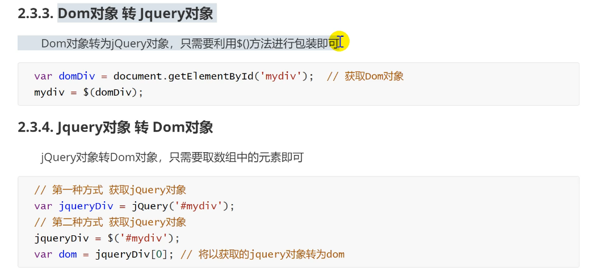

## 层次选择器

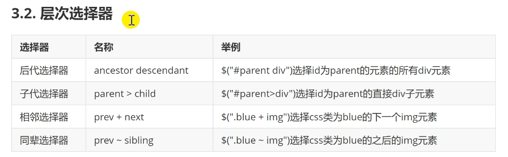

## 表单选择器

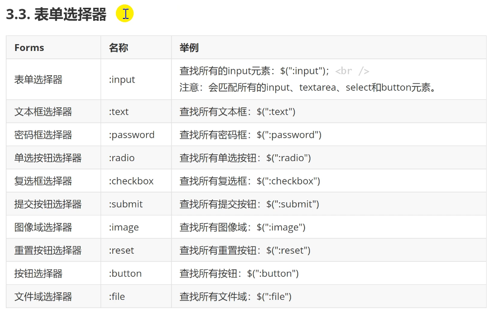

## jquery dom操作

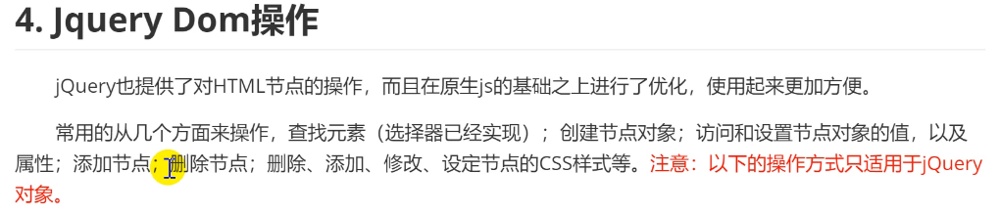

### 操作元素的属性

#### 获取属性

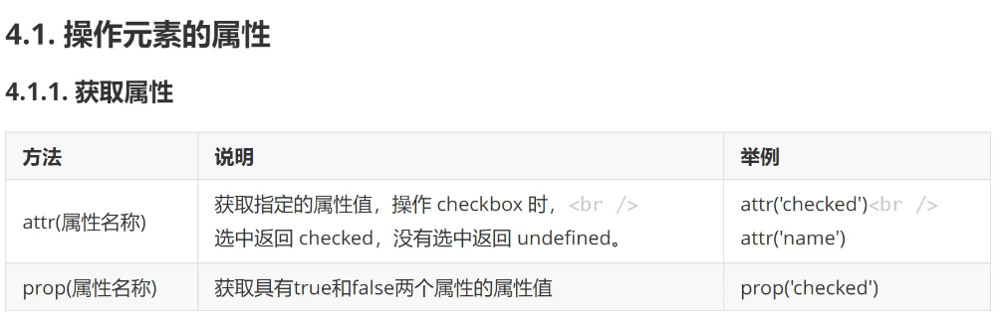

**属性的类型**

- 固有属性（元素本身就有的属性）：id，name，class，style。。。
- 返回值是Boolean的属性：checked，selected，disabled
- 自定义属性

**两种操作区别**

1. 如果是固有属性，两者均可操作
2. 自定义属性，attr可以获取，prop不能操作
3. Boolean类型属性，若设置了属性，attr返回具体值，prop返回true；否则attr是undefined，prop返回false

#### 设置属性

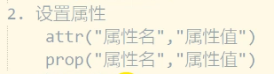

#### 移除属性

```html
removeAttr("属性名")
```

### 操作元素的样式

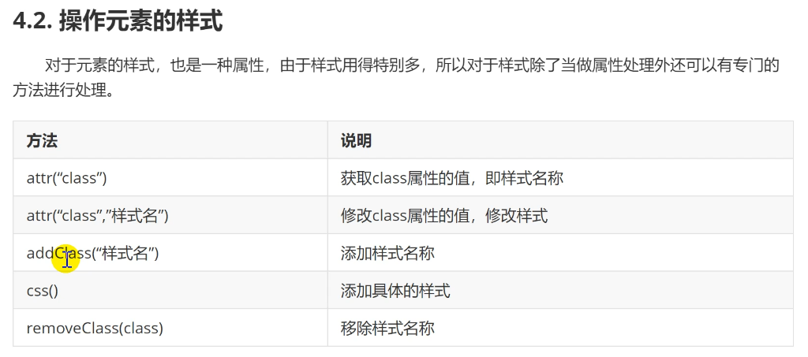

attr来设置时会覆盖

addClass在原来的样式基础上添加样式，如果有相同样式则以后来的为准	

css添加行内样式（优先级高）；设置多个样式可以 `css({"":"", "":"" })` 

### 操作元素的内容

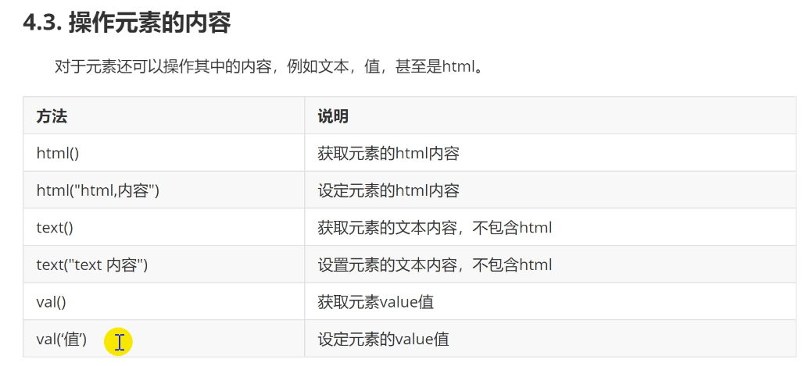

此处html标签不包含表单元素

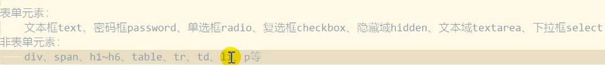

val用于操作表单元素的值

### 创建元素

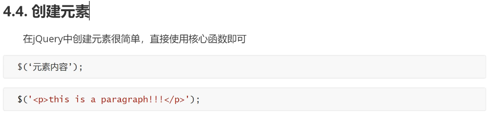

### 添加元素

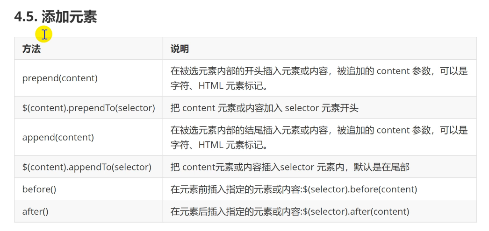

## Ajax

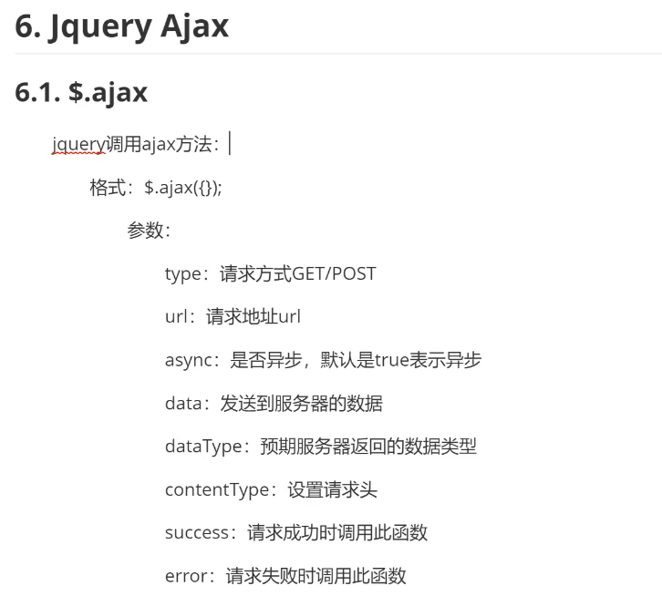

异步

多用于局部刷新和无刷新


### get, post, getJSON

格式：

$.get/post/getJSON("地址","请求参数",function(形参){})

getJSON当地址不是json格式时无法获取


# 一些问题

出现问题：运行pycharm文件时，放在templates下的jquery文件无法被找到

解决：放入static文件夹中