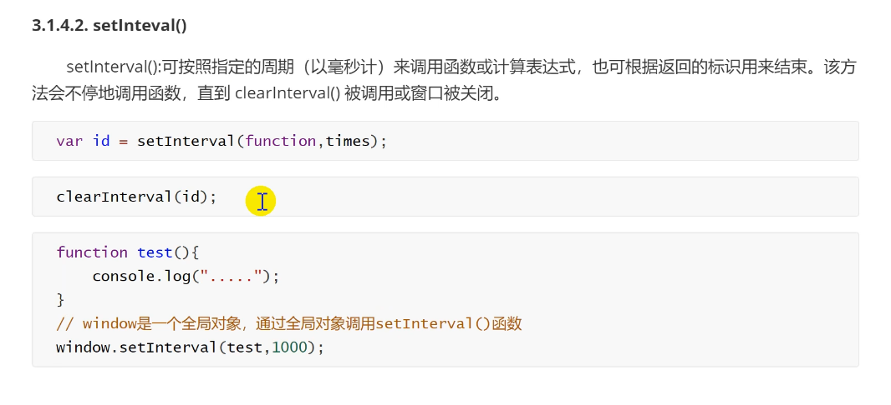

## 基本用法

分为行内，内部和外部

**和css一样**

js 代码推荐放在body标签后。最好等html元素执行完后再执行。


上图为三种使用方式。

## 基础语法

### 变量

声明变量时不需要指定数据类型


只有用var声明的变量才会提升

### 数据类型


#### undefined

表示值不存在

1. 定义了未赋值便使用；
2. 调用函数时未传递实参；
3. 函数没有返回值，默认返回undefined；


#### null


#### 数值型

整形和浮点型都以64位浮点类型存储

浮点类型最高精度时17位，有误差不建议用作判断

存储时自动将1.0转换成1

#### 字符串

#### 对象

### 类型转换

#### 自动类型转换


#### 函数转换


#### 显示转换


### 运算符


#### 逻辑语句


### 数组

#### 定义


数组中数据类型任意

#### 基本操作

数组长度可以通过length属性得到，并可任意修改。

索引可以越界。

可以使用非正整数作为索引：称之为数组属性，不影响长度

#### 数组遍历


不遍历属性


不遍历undefined


不遍历属性和undefined

### 数组方法


### 函数

#### 定义


如果使用函数声明语句具有函数名提升效果。

js没有方法重载，如果同名则覆盖。


#### 函数的调用

1. 直接调用：函数名([参数列表])；
2. 函数调用（有返回值时用）；
3. 对象调用（函数是对象中的属性时）：对象.函数名([参数列表])；

#### 函数的返回

有返回值用return，没有则无返回值或返回undefined；

没有返回值时return则结束方法。

#### 函数的作用域


JS中只有函数有作用域

### 内置对象

Array 数组对象；

Date 日期对象，用来创建和获取日期；

Math 数学对象；

String 字符串对象；


### 对象


#### 对象的创建

##### 字面量形式创建


格式：键: 值

obj.key = value

##### new Object创建


##### var 对象名 = Object.create(参考对象)

以参考对象为模板

#### 对象的序列化和反序列化


#### this


##### 在函数中使用

this可指window对象

##### 在对象中使用


总结：this指调用函数的对象（全局为window）

## JS事件

### 主要内容


### 事件


作用：


几个名词：


### 事件流和事件捕获

事件流顺序：事件冒泡到事件捕获

#### 事件冒泡


#### 事件捕获


#### DOM事件流


### 事件处理程序

以on开头

#### html事件处理程序

对html标签添加

#### DOM 0级事件处理程序


只能为同一个元素的同一个事件设置一个事件程序（会覆盖）

script不能写到前面

特殊情况


#### DOM 2级事件处理程序


addEventListener(), removeEventListener()

三个参数：事件名、事件处理程序，事件冒泡或事件捕获

example：


可以为同一个元素同一个事件设置多个事件。

[常用事件网站](https://www.w3school.com.cn/jsref/jsref_events.asp)

### BOM 对象


#### 系统对话框


alert() 会阻止后续代码的执行

#### 打开窗口


#### 关闭窗口


#### 时间函数




### History对象


### Location对象


## DOM对象


### 节点


```html
<html>
    <head>
        <title>树！</title>
    </head>
    <body>
        <div title="属性节点">
            测试 div
        </div>
    </body>
</html>
```


#### 获取节点


<font color=red> 操作必须等节点初始化完毕 </font>

#### 创建和插入节点


newItem: 要插入的节点；existingItem: 参考节点（需要参考父节点）

parentElement.insertBefore(newChild, refChild)


#### 间接查找节点


children：返回元素的所有子元素

**注意：这里的文本节点包含换行符**

firstElementChild,  lastElementChild

所有以上方法包含元素节点对象

#### 删除节点


## 表单


### 获取表单


通过name属性获得

**注意：3中的索引为表单名称**

### 获取表单元素

#### input


#### 单选


#### 多选


#### 下拉框


.options：获取所有下拉选项

### 提交表单


.trim(): 去除前后空格（不去除中间空格）

### 表单校验

## JQuery


### JQuery核心


