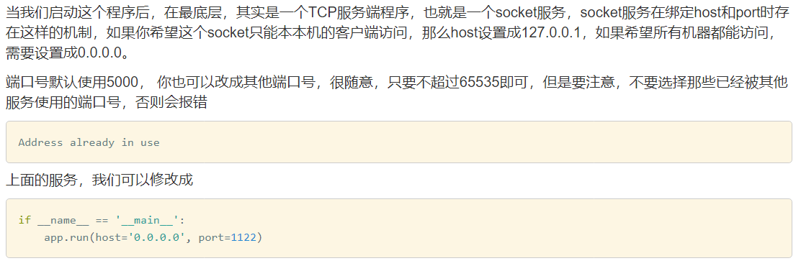
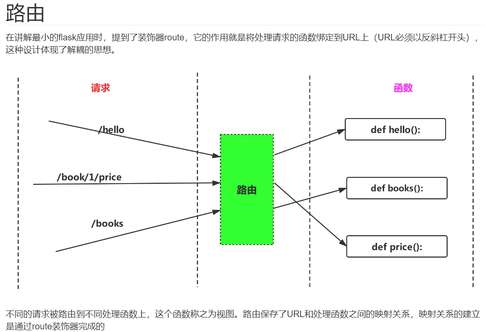

## 一个最小的flask应用

```python
from flask import Flask
app = Flask(__name__)


@app.route('/')
def hello_world():
    return 'Hello World!'


if __name__ == '__main__':
    app.run()
```

### 面向对象

flask是一个类，app是这个类的实例，也可说是对象。app在创建时需要传入参数`import_name`，通常使用`__name__` .

### 装饰器

`route`是一个装饰器，用来装饰函数 `hello_world()`，当请求的path是 `/`时，程序用`hello_world()`来处理。

### 服务器监听设置



## 路由



### 变量规则

设置 url 的变化部分

变化规则 `<converter:var_name>`，不指定转换器则默认转为字符串

使用例

```python
@app.route('/book/<int:id>/price')
def price(id):
    return str(id)
```

### 路由管理规则

除了route外还可用add_url_rule

```python
def add_rule():
    return 'add url rule'


app.add_url_rule('/add_url', 'add_rule', add_rule)
```

### 设置method

一个url可以使用不同的方法来请求

在route装饰器中设置methods，如果不设置该参数，则默认支持GET方法。

如果要处理多个请求，就需要用到请求对象request

## 视图

```python
@app.route('/hello')
def hello():
    return 'hello'
```

通过route装饰器，将一个url与函数关联在一起，则称这个函数会视图函数。一个视图函数用来处理一个请求，最终返回数据。

## 请求对象request

request是全局对象，你可以通过它来获得当前进入的请求数据，如果是在多线程环境下，flask可以保证你所使用的request对象就是当前这个线程所处理的请求。

```python
from flask import Flask

app = Flask(__name__)


from flask import Flask, request
app = Flask(__name__)


@app.route('/', methods=['GET', 'POST'])
def users():
    print(request.method)       # 请求方法
    print(request.headers)      # 请求的headers
    print(request.path)         # 资源路径
    print(request.url)          # 完整的url
    print(request.remote_addr)  # 客户端IP
    print(request.cookies)      # 请求的cookie
    return 'okk'


if __name__ == '__main__':
    app.run(debug=True)
```

## flask解析http请求数据

### get

用于查询数据，通常带有参数。参数放在path后面，中间用?连接，多个参数中间用&相连

请求参数可通过`request.args` 或 `request.values` 来获得

注意获得的参数都是字符类型，使用时需要类型转换

```python
@app.route('/users', methods=['GET', 'POST'])
def users():
    name = request.args['name']
    age = request.args['age']
    print(name, age)
    return 'ok'
```

### post

用于新增数据，有两种提交格式form, json。requests.form里存储着post请求提交的form表单数据

```python
@app.route('/users', methods=['POST'])
def users():
    name = request.form['name']
    age = request.form['age']
    print(name, age)
    return 'ok'
```

不论是request.args， 还是request.form，其类型都是MultiDict，因此，flask又提供了一个request.values，类型为CombinedMultiDict，它包含了args和form,这样，在获取数据时，就不必在纠结到底用args还是用form了，request.values使用方法与args,form相同。

post提交的json数据，不能通过args,form.values来获取，而是要用get_json()方法来获取。

## 模板


## 响应对象Response


## 提交表单

使用例

```html
<form action="/login" method="POST">
      <p>name: <input type="text" name="name" /></p>
      <p>password: <input type="password" name="password" /></p>
      <input type="submit" value="提交" />
</form>
```

```python
@app.route('/login', methods=['GET', 'POST'])
def do_login():
    if request.method == 'GET':
        return render_template('login.html')
    else:
        name = request.form['name']
        password = request.form['password']
        if name == 'python':
            return render_template('index.html', name=name)
        else:
            return redirect('/login')
```

### 密码加密

可使用md5（每次产生密文一样）或generate_password_hash（每次产生密文不一样）

出现问题：open打不开相对路径表示的文件；解决：换用绝对路径

## 文件上传

出现问题：上传文件出现Internal Server Error；解决：要先建立接受文件的文件夹📂

## 文件下载