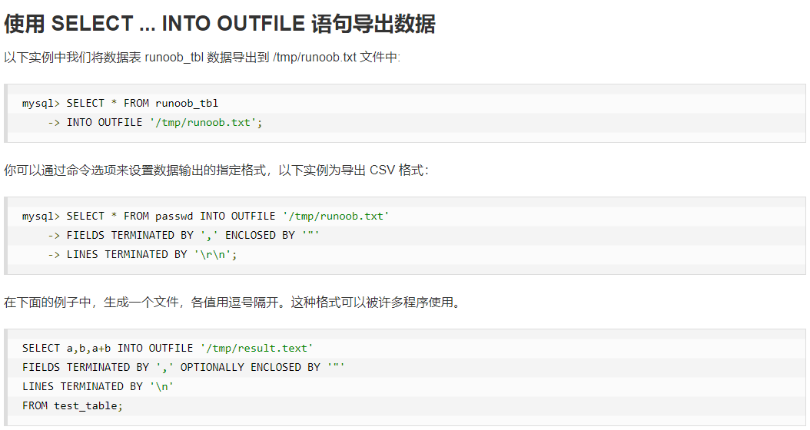

- /24F%iorFtHM


C:\Program Files\MySQL\MySQL Server 8.0\bin\mysqld.exe

# MySQL Note

## mysql管理

### mysql用户设置

？？？

### 管理mysql的命令

- use 数据库名; //选择要操作的数据库
- show databases; //列出数据库列表
- show tables; //列出当前数据库下的所有表
- show columns from 数据表; //显示数据表的属性，属性类型，主键类型是否为null，默认值等信息
- show index from 数据表; //显示数据表的详细索引信息

## mysql 连接

```php
mysqli_connect(host, username, password, dbname, port, socket);
```


```php
bool mysqli_close(mysqli $link)
```

关闭指定链接标识所关联到的mysql服务器

## 创建数据库

create database 数据库名;

## 删除数据库

drop database 数据库名;

## 创建数据表

```mysql
CREATE TABLE table_name (column_name column_type);
```

例

```mysql
CREATE TABLE IF NOT EXISTS `runoob_tbl`(
   `runoob_id` INT UNSIGNED AUTO_INCREMENT,
   `runoob_title` VARCHAR(100) NOT NULL,
   `runoob_author` VARCHAR(40) NOT NULL,
   `submission_date` DATE,
   PRIMARY KEY ( `runoob_id` )
)ENGINE=InnoDB DEFAULT CHARSET=utf8;
```


## 数据类型

主要分为数值、日期/时间和字符串类型

### 数值


### 日期和时间


### 字符串


## 插入数据

```mysql
insert into table_name (field1,...,fieldN)
    values(value1,..., valueN);
```

## 读取数据

```mysql
select column_name1,column_name2 from table_name
[Where Clause]
[limit N][offset M]
```

- 可以使用一个表或多个表，并使用where语句来设定查询条件。
- select命令可以读取一条或多条记录。
- 可以使用（*）来代替其他所有字段
- limit属性来设定返回的记录数。
- offset指定开始查询的数据偏移量，默认为0。

## WHERE子句

```mysql
[where condition1 and/or condition2 ...]
```

注意其相等为=，不等可为<>。


## UPDATE更新

向其中加入新数据

```mysql
update table_name set field1=new_value1,...
[where ...]
```

## DELETE语句

```mysql
delete from table_name [where Clause]
```

- 如果不指定where则删除全部语句。

## LIKE子句

选取一类记录

```mysql
select field1,...,fieldN
from table_name
where field1 like condition1 and/or ...
```

- like通常和%一起使用，%来表示任何字符
- 有时会使用'_'（每一个下划线表示一个任意字符）

## UNION操作符

用于连接不同select查到的结果

```mysql
SELECT expression1, expression2, ... expression_n
FROM tables
[WHERE conditions]
UNION [ALL | DISTINCT]
SELECT expression1, expression2, ... expression_n
FROM tables
[WHERE conditions];
```

distinct: 删除结果中的重复数据，默认已经删除重复数据所以没什么用

all: 返回所有结果，包含重复数据

## ORDER BY排序

```mysql
SELECT field1, field2,...fieldN FROM table_name1, table_name2...
ORDER BY field1 [ASC [DESC][默认 ASC]], [field2...] [ASC [DESC][默认 ASC]]
```

ASC 升序；DESC 降序

## GROUP BY语句

根据一个或多个列对结果进行分组

```mysql
SELECT column_name, function(column_name)
FROM table_name
WHERE column_name operator value
GROUP BY column_name;
```

## mysql连接的使用

```mysql
inner join 获取两个表中字段匹配关系的记录
left join 获取左表的所有记录，即使右表没有相应的记录
right join 与left join相反
```

使用例

```mysql
mysql> SELECT a.runoob_id, a.runoob_author, b.runoob_count FROM runoob_tbl a INNER JOIN tcount_tbl b ON a.runoob_author = b.runoob_author;
+-------------+-----------------+----------------+
| a.runoob_id | a.runoob_author | b.runoob_count |
+-------------+-----------------+----------------+
| 1           | 菜鸟教程    | 10             |
| 2           | 菜鸟教程    | 10             |
| 3           | RUNOOB.COM      | 20             |
| 4           | RUNOOB.COM      | 20             |
+-------------+-----------------+----------------+
4 rows in set (0.00 sec)
```


left join会读取左边数据表的所有选取的字段数据，即使右表中没有对应的字段值（null）


right join相反

## NULL值处理

```mysql
IS NULL 当值时NULL时返回true
IS NOT NULL 非NULL时返回true
<=> 比较操作符，当比较的两个值相等或都为NULL时返回true
```

## 正则表达式

使用REGEXP操作符来正则表达式匹配


使用例


## mysql事务

由一系列操作语句构成

- **原子性**：一个事务中的所有操作，要么全部完成，要么全部不完成。事务执行发生错误会被滚回到事物开始前的状态。
- **一致性**：写入的资料必须完全符合预设的规则，数据库的完整性没有破坏。
- **隔离性**：数据库允许多个并发事件同时对其数据进行读写和修改的能力。可分为读未提交（Read uncommitted）、读提交（read committed）、可重复读（repeatable read）和串行化（Serializable）。
- **持久性**：事务处理结束后，对数据的修改就是永久的，即使系统故障也不会丢失。

事务控制语句

- BEGIN或START TRANSACTION显式开启一个事务；
- COMMIT会提交事务，使其对数据库的修改成为永久性的；
- ROLLBACK 结束用户事务，撤销正在进行的所有未提交修改；
- SAVEPOINT identifier 在事务中创建一个保存点，一个事务中可有多个保存点；
- RELEASE SAVEPOINT identifier 删除一个事务的保存点，当没有指定保存点时会抛出一个异常；
- ROLLBACK TO identifier 把事务回滚到标记点；
- SET TRANSACTION 来设置事务的隔离级别。包括READ UNCOMMITTED, READ COMMITTED, REPEATABLE READ, SERIALIZABLE.

可以通过SET AUTOCOMMIT = 0/1 来禁止/开启自动提交

## ALTER命令

用于修改数据表名或修改数据表字段时

```mysql
ALTER TABLE 表格名 DROP 字段名; //删除字段
ALTER TABLE 表格名 ADD 字段名 数据类型 (FIRST/ AFTER 存在字段); //添加字段到数据表末尾或指定处
ALTER TABLE 表格名 MODIFY 存在字段名 新数据类型 ((NOT) NULL DEFAULT ...); //修改存在字段数据类型（同时可设定是否为空和默认值）
ALTER TABLE 表格名 CHANGE 存在字段名 新字段名 新数据类型; //修改存在字段名和数据类型（新字段名可以与之前相同）
ALTER TABLE 表格名 ALTER 字段名 SET DEFAULT 默认值/ DROP DEFAULT; //修改/取消默认值
ALTER TABLE 表格名 RENAME TO 新表格名;
```

## 索引

索引分为单索引（一个索引包含单个列）和组合索引（一个索引包含多个列）。

索引可以快速查找到需要的字

但过多的索引会降低表的更新速度，还会占用磁盘空间的索引文件。

### 普通索引

```mysql
CREATE INDEX indexName ON tableName (columnName) //创建索引
ALTER TABLE tableName ADD INDEX indexName(columnName) //修改表结构
CREATE TABLE mytable( //创建表时直接指定
ID INT NOT NULL,   
username VARCHAR(16) NOT NULL,  
INDEX [indexName] (username(length))  
);
DROP INDEX indexName ON mytable; //删除索引
```

### 唯一索引

索引列的值必须唯一，但允许有多个null；如果是组合索引，则列值的组合必须唯一

```mysql
create unique index indexName on mytable(username(length)); //创建索引
alter table mytable add unique [indexName] (username(length)); //修改表结构
CREATE TABLE mytable( //创建表时直接指定
ID INT NOT NULL,
username VARCHAR(16) NOT NULL,
UNIQUE [indexName] (username(length))
);
```

### 添加和删除主键

主键作用于列上（一个列或多个列联合主键）。添加主键索引时需要确保主键默认不为空

```mysql
alter table testalter_tbl modify i int not null;
alter table testalter_tbl add primary key (i);
alter table testalter_tbl drop primary key (i);
```

## 临时表

临时表仅当前连接，关闭后mysql自动删除表并释放所有空间。

```mysql
create temporary table ... //以下同 create table
```

## 复制表

完全复制表，包括结构，索引，默认值

- 使用 `show create table` 命令获得创建数据表的语句，包含了原数据表结构索引等。
- 复制其显示的sql语句，修改数据表名，从而获得相同结构的数据表。
- 使用 `insert into ... select` 实现内容复制

## 元数据


## 序列使用

如想实现出自增主键外其他字段也自动增加，使用auto_increment

### 重置序列

如果你删除了数据表中的多条记录，并希望对剩下数据的AUTO_INCREMENT列进行重新排列，那么你可以通过删除自增的列，然后重新添加来实现。 不过该操作要非常小心，如果在删除的同时又有新记录添加，有可能会出现数据混乱。

设置序列开始值


## 处理重复数据

### 防止表中出现重复数据


如果我们设置了唯一索引，那么在插入重复数据时，SQL 语句将无法执行成功,并抛出错。

INSERT IGNORE INTO 与 INSERT INTO 的区别就是 INSERT IGNORE INTO 会忽略数据库中已经存在的数据，如果数据库没有数据，就插入新的数据，如果有数据的话就跳过这条数据。这样就可以保留数据库中已经存在数据，达到在间隙中插入数据的目的。

```mysql
SELECT COUNT(*) as repetitions, last_name, first_name
FROM person_tbl
GROUP BY last_name, first_name
HAVING repetitions > 1;
```

### 统计重复数据


### 删除重复数据


## sql注入

所谓SQL注入，就是通过把SQL命令插入到Web表单递交或输入域名或页面请求的查询字符串，最终达到欺骗服务器执行恶意的SQL命令。

## 导出数据



## mysql函数

[MySQL 函数 | 菜鸟教程 (runoob.com)](https://www.runoob.com/mysql/mysql-functions.html)

## mysql运算符

[MySQL 运算符 | 菜鸟教程 (runoob.com)](https://www.runoob.com/mysql/mysql-operator.html)

# Python 操作数据库

## 数据库查询操作

- **fetchone()**: 返回下一个查询结果集。结果集是一个对象。
- **fetchall()**: 接受全部的返回结果行。
- **rowcount()**: 返回执行excute方法后影响的行数。

## 错误处理


# 其他知识

## mysql锁

指两个或两个以上的进程咋执行过程中，因争夺资源而产生的互相争夺的现象

# 问题

发现问题：pymysql在插入后刷新没有出现条目

解决：要commit