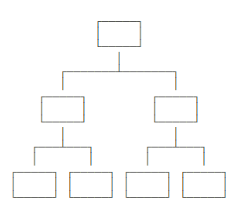
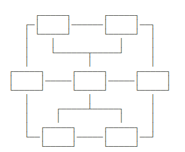
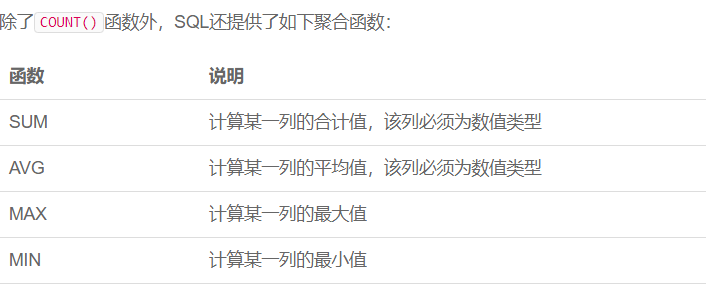
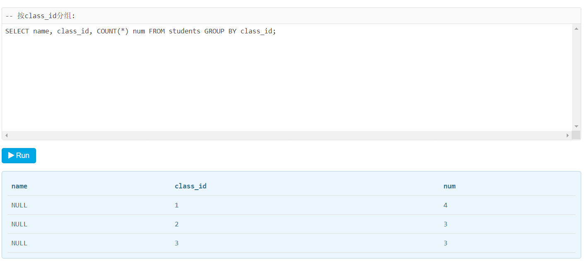

# SQL教程

------

## 关系数据库概述

随着应用程序的功能越来越复杂，数据量越来越大，如何管理这些数据就成了问题

- 读写文件和解析数据需要大量重复代码；
- 快速查询数据需要复杂的逻辑

### 数据模型

层状模型（树状）



网状模型



关系模型


二维表之间就通过ID映射建立了“一对多”关系。

### 数据类型


### 主流关系数据库

1. 商用数据库，如：Oracle, SQL Server, DB2等；
2. 开源数据库，如MySQL, PostgreSQL等；
3. 桌面数据库，如微软Access
4. 嵌入式数据库，以Splite为代表

### SQL

结构化查询语言的缩写

SQL虽然已成为标准，但各个不同数据库对标准sql的支持不太一致。如果使用某个数据库特有的SQL则换一个数据库就会失效

- DDL: Data Definition Language 包括创建表、删除表、修改表结构等操作。
- DML: Data Manipulation Language 包括为用户添加、删除、更新数据的能力
- DQL: Data Query Language 包括用户查询数据

sql数据库语言关键字不区分大小写，但对于表名和列名，取决于数据库和操作系统

## MySQL

mysql本身只是一个sql接口，内部包含多种数据接口，最常用的有InnoDB

## 关系模型

字段是表的每一列，定义了数据类型，以及是否允许为NULL，注意NULL不等于空字符串

通常情况下，字段应避免允许为null不允许为null可以加快查询速度，减少判断

## 主键

对于关系表，任意两条记录不能重复，指能够通过某个字段唯一区分不同的记录，这个字段被称为**主键**。

主键最好不要修改，因此任何与业务相关的字段就不可以作为主键

一般我们将主键设置为id，一般可用类型有

- 自增类型
- 全局唯一GUID类型

### 联合主键

设置多个字段为主键，此时只要不是所有列都重复即可

## 外键 foreign key

外键是指一张表中的关联另外一张表的字段

外键是通过定义外键约束实现的

```mysql
ALTER TABLE students
ADD CONSTRAINT fk_class_id
FOREIGN KEY (class_id)
REFERENCES classes (id);
```

外键约束会降低程序的性能，实际上多靠程序内部来保证逻辑的正确性

有些应用会把一张大表拆成两个一对一的表，把经常读取的和不常读取的字段分开，以提高查询效率

## 索引

索引是关系数据库中对某一列或多个列的值进行预排序的数据结构，在数据量极大时加快查询速度的。

如果经常要对某一列进行查询，就可对这一列创建索引

索引的效率取决于该列是否散列，即如果该列越不同，索引效率越高。

## 具体使用

使用`LIMIT <M> OFFSET <N>`分页时，随着`N`越来越大，查询效率也会越来越低。

### 聚合函数



### 分组

在聚合查询的列中只能放入能分组的列



### 多表查询

查询结果是两个表的积，即列数是两表列数之和，行数是两表行数之积

### 实用sql语句

#### 插入或替换

插入一条记录，如果记录已经存在就删除原纪录

```mysql
REPLACE INTO students (id, class_id, name, gender, score) VALUES (1, 1, '小明', 'F', 99);
```

#### 插入或更新

```mysql
INSERT INTO students (id, class_id, name, gender, score) VALUES (1, 1, '小明', 'F', 99) ON DUPLICATE KEY UPDATE name='小明', gender='F', score=99;
```

#### 快照

复制一份当前的数据表到新表

```mysql
-- 对class_id=1的记录进行快照，并存储为新表students_of_class1:
CREATE TABLE students_of_class1 SELECT * FROM students WHERE class_id=1;
```

#### 写入查询结果集

```mysql
INSERT INTO statistics (class_id, average) SELECT class_id, AVG(score) FROM students GROUP BY class_id;
```

#### 强制使用指定索引

自定义使用查询索引

```mysql
SELECT * FROM students FORCE INDEX (idx_class_id) WHERE class_id = 1 ORDER BY id DESC;
```

### 事务

#### Read Uncommitted

一个事务会读到另一个事务更新后但未提交的数据，如果另一个事务回滚，那么当前事务读到的数据就是脏数据，这就是脏读（Dirty Read）。

#### Read Committed

在Read Committed隔离级别下，一个事务可能会遇到不可重复读（Non Repeatable Read）的问题。

不可重复读是指，在一个事务内，多次读同一数据，在这个事务还没有结束时，如果另一个事务恰好修改了这个数据，那么，在第一个事务中，两次读取的数据就可能不一致。

#### Repeatable Read

在Repeatable Read隔离级别下，一个事务可能会遇到幻读（Phantom Read）的问题。

幻读是指，在一个事务中，第一次查询某条记录，发现没有，但是，当试图更新这条不存在的记录时，竟然能成功，并且，再次读取同一条记录，它就神奇地出现了。

#### Serializable

最严格的隔离级别，脏读、不可重复读、幻读都不会出现

## SQL & NoSQL

### 语言

sql是结构化的，比较安全，同时比较死板：功能比较限制，操作比较复杂。需要预先定义结构

nosql是非结构化的，动态，以多种方式储存。不需要预先定义结构

### 可伸缩性

sql数据库几乎在所有情况下都可垂直扩展（扩大ram,ssd,cpu）

nosql可以横向扩展，即在数据库中添加更多建筑物来处理更多流量。这适合大型或不断变化的数据集

### 结构

sql数据库基于表

nosql基于键值对、文档、图形数据库或宽列储存

### 遵循的属性

sql ACID

nosql Brewers CAP定理

### 具体实例

sql：Oracle、Sybase、Informix

nosql：Redis（键值对）, HBase（列储存）, MongoDB（文档）, Neo4J（图形）